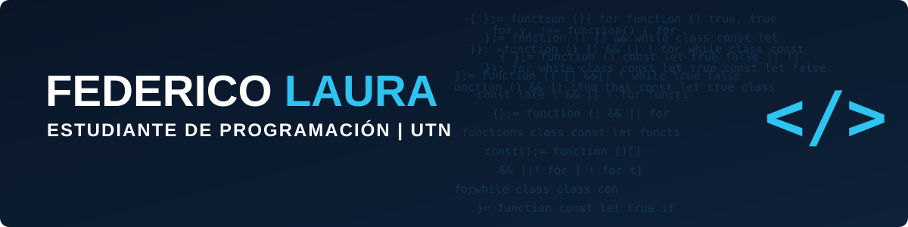

<div align="center">



</div>

---

# Hola, soy Fede 👋

Estudiante de primer año de la **Tecnicatura Universitaria en Programación** (UTN Avellaneda).
Enfocado en **desarrollo de software**.
Formación autodidacta previa en Python, Git y web básica, ahora profundizando con base académica.

```
🔭 En constante aprendizaje 👨🏽‍💻
```
---

## Stack

<p>
  
</p>

---

### Proyectos

| Proyecto | Qué es | Stack |
|---|---|---|
| **Sistema de Gestión de Alumnos** | App de gestión de alumnos con operaciones CRUD | `Python` |
| **Portfolio** | Sitio personal donde muestro quien soy, mis skills y proyectos | `HTML/CSS` |

---

### Contacto

<p>
  <a href="https://github.com/federico-LauraARG"></a>
  <a href="https://linkedin.com/in/federicolaura24dev"></a>
</p>
